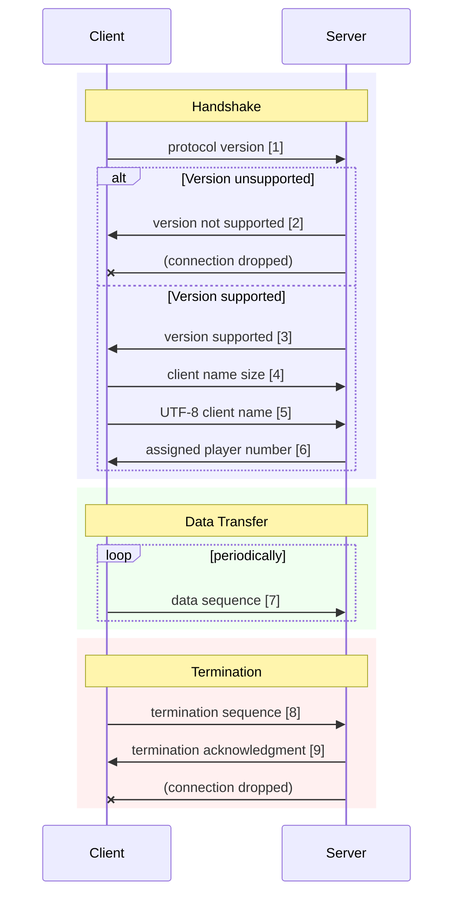

# The Vircon Protocol

The **Vircon Protocol** defines the communication between a **Vircon client** and a **Vircon server** over a LAN connection, with a focus on low latency and minimal overhead, to ensure smooth gameplay.

This document describes **version 0.1** of the protocol, with its three main components: handshake, data transfer, and termination.

### Sequence Diagram

### Message Formats

| # | Sender | Format            | Length   | Description                                  |
| - | ------ | ----------------- | -------- | -------------------------------------------- |
| 1 | Client | `[major, minor]`  | 2 bytes  | Protocol version (e.g. `[0x01, 0x00]`)       |
| 2 | Server | `[0x00]`          | 1 byte   | Version not supported                        |
| 3 | Server | `[0x01]`          | 1 byte   | Version supported                            |
| 4 | Client | `[name_length]`   | 1 byte   | Length of UTF-8 client name                  |
| 5 | Client | `[name...]`       | N bytes  | UTF-8 encoded client name (N = name\_length) |
| 6 | Server | `[player_number]` | 1 byte   | Assigned player number (0–255)               |
| 7 | Client | `[input_data]`    | 10 bytes | Packed input snapshot                        |
| 8 | Client | `[0xFF x 10]`     | 10 bytes | Termination signal                           |
| 9 | Server | `[0x01]`          | 1 byte   | Termination acknowledgment                   |

### Transport Layer

The protocol uses **TCP** as the transport layer to ensure reliable delivery. Future major versions may switch to a different transport protocol.

### Input Snapshot

Each data packet is exactly 10 bytes, and packed as follows:

| Bits  | Description                                                      |
| ----- | ---------------------------------------------------------------- |
| 0–13  | A, B, X, Y, L1, R1, L2, R2, Up, Down, Left, Right, Select, Start |
| 14–15 | Padding bits (always 0)                                          |
| 16–31 | 16-bit signed left joystick X offset                             |
| 32–47 | 16-bit signed left joystick Y offset                             |
| 48–63 | 16-bit signed right joystick X offset                            |
| 64–79 | 16-bit signed right joystick Y offset                            |

### Versioning

* **Development Versions**:
  Versions with a **major version of 0** are considered unstable and incompatible with each other.

* **Backward Compatibility**:
  Versions with the **same major version (≥1)** but different minor versions are considered compatible.

* **Breaking Changes**:
  A **different major version** indicates breaking changes (e.g. protocol structure, transport layer).

### Design Notes

* **Zero-length names** (`""`) are currently permitted. Future versions may require a minimum length of 1 byte.

* **No error codes** are defined in this version. Future versions may include explicit codes (e.g. server full, client banned).
